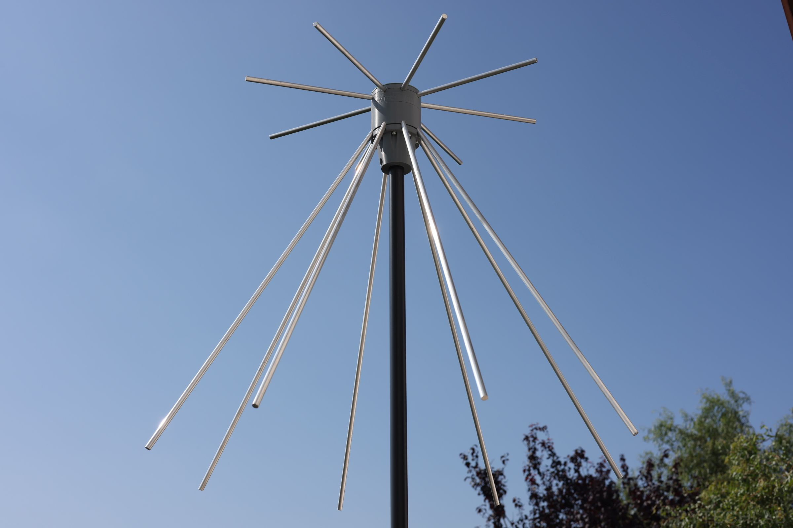

    

Mostly 3D printed discone antenna for Software Definied Radio.

### Read more at BYTECHLAB:

<table style="width: 100%; border: none;" cellspacing="0" cellpadding="0" border="0">
  <tr>
    <td></td>
    <td>https://bytechlab.com/2018/05/mostly-3d-printed-discone-antenna/</td>
  </tr>
</table>

